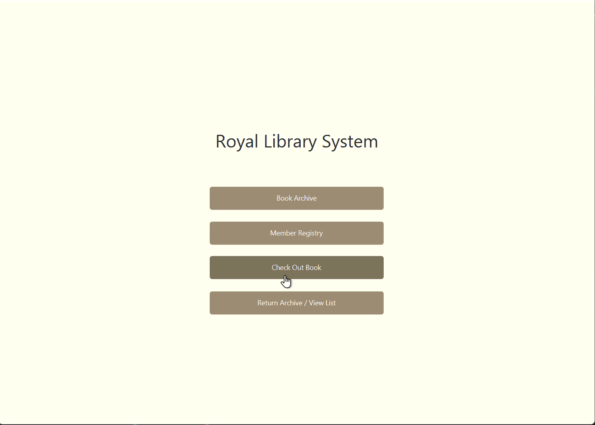

# Library System 📚💻


> a JavaFX-based library management system with database support, designed to manage books, members, and borrowing efficiently.
  


---

## 💡 overview

The library system is a **JavaFX desktop application** that uses a database to manage books, members, and borrow/return operations.  
built with **java & javafx**, it demonstrates **object-oriented principles, database connectivity, and interactive gui design**.  

perfect for learning **Java programming, oop concepts, and GUI development**, and for showcasing **practical project skills** in your portfolio.

---

## 🌸 features

- **Book Management:** add, edit, delete, and search books  
- **Member Management:** manage library members and their details  
- **Borrow & Return System:** track which books are borrowed and returned  
- **Database Integration:** persistent data using SQLite/MySQL  
- **Interactive GUI:** clean, user-friendly JavaFX interface with tables, forms, and buttons  
- **OOP Principles:** classes, inheritance, encapsulation, and modular design  

---

## 🛠 tech stack

`java` | `javafx` | `sqlite/mysql` | `object-oriented programming` | `git`  

> emphasis on **clean code, modular design, and interactive GUI development**

---


## 🚀 how to run locally

1. Clone the repo:

```bash
git clone https://github.com/hxnx444/Library-System.git
```
2. Navigate to the src folder and compile:

```bash
Copy code
javac -cp ".;../lib/*" *.java
```
3. Run the main program:

```bash
Copy code
java -cp ".;../lib/*" Main
```
Adjust the classpath for your system if needed. Requires JavaFX SDK installed.

---
## 🧠 challenges & learnings

Implemented OOP principles in a real-world application

handled database connectivity and CRUD operations

designed a user-friendly JavaFX GUI

practiced modular coding, problem-solving, and debugging

strengthened Java programming, GUI design, and database management skills

---

## 🔮 future improvements

Add a login system with user roles (admin, librarian)

Implement better exception handling and input validation

Add reporting features for books and member activity

consider migration to full JavaFX + database backend GUI app

---

## 🎯 conclusion

The library system demonstrates practical OOP skills, database handling, and GUI development in JavaFX.
perfect for portfolio showcase, teaching projects, or anyone wanting a clean example of a Java desktop application with database support.

Thanks for checking it out! 💫
Run it locally and explore the system yourself.
